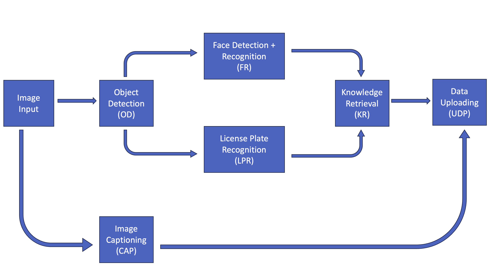

### A realistic pipeline we built for evaluation

# Teaspoon — Rebuttal Tables

---

## Table 1: Per-Module Computational Cost (Traffic Monitoring Pipeline)

| Module | Input | GMACs | GFLOPs | Total GFLOPs |
|---|---|---|---|---|
| RT-DETR-R50 (Object Detection) | 640×640 | ~67.0 | ~134.0 | ~134.0 |
| MTCNN (Face Detection) | 720×1280 frame | ~3.79 | ~7.58 | ~10.42 |
| InceptionResnetV1 (Face Recognition) | 160×160 face | ~1.42 | ~2.84 | |
| DeepLabV3-ResNet50 (LPR) | 520×520 | ~166.0 | ~332.0 | ~332.0 |
| GIT-base prefill (Image Captioning) | 224×224 | ~27.1 | ~54.2 | ~90.8 |
| GIT-base AR decode (×10 tokens) | 224×224 | ~18.4 | ~36.8 | |
| Knowledge Retrieval (GPT2Tokenizer + SQLite3) | — | negligible | negligible | ≈0 |
| Data Upload (UDP) | — | negligible | negligible | ≈0 |

---

## Table 2: TFLOPs Breakdown by Module and Method

| Method | OD (TFLOPs) | FR (TFLOPs) | LPR (TFLOPs) | CAP (TFLOPs) | Total (TFLOPs) | ×Clean |
|---|---|---|---|---|---|---|
| clean | 13.40 | 1.97 | 5.31 | 3.45 | 24.13 | 1.0× |
| overload | 13.40 | 137.54 | 687.24 | 0.82 | 839.00 | 34.8× |
| phantom | 13.40 | 37.10 | 9.63 | 2.18 | 62.30 | 2.6× |
| slowtrack | 13.40 | 107.33 | 687.24 | 1.82 | 809.78 | 33.6× |
| ours | 13.40 | 95.24 | 29.22 | 2.81 | 140.67 | 5.8× |
| ours (0) | 13.40 | 978.44 | 0.33 | 0.36 | 992.53 | 41.1× |
| ours (2) | 13.40 | 0.21 | 30,245.20 | 0.54 | 30,259.35 | **1,254.0×** |
| ours (0,2) | 13.40 | 898.20 | 2,589.60 | 0.36 | 3,501.57 | 145.1× |

---

## Table 3: Workload Counts by Module and Method

| Method | IMG (×10²) | OD (×10²) | FR | LPR | KR | CAP | UDP |
|---|---|---|---|---|---|---|---|
| clean | 1.00 | 1.00 | 1.89×10² | 1.60×10¹ | 2.05×10² | 3.80×10¹ | 2.43×10² |
| ours (2) | 1.00 | 1.00 | 2.00×10¹ | **9.11×10⁴** | 9.11×10⁴ | 6.00 | 9.11×10⁴ |
| ours (0) | 1.00 | 1.00 | **9.39×10⁴** | 1.00 | 9.39×10⁴ | 4.00 | 9.39×10⁴ |
| ours (0,2) | 1.00 | 1.00 | 8.62×10⁴ | 7.80×10³ | **9.40×10⁴** | 4.00 | **9.40×10⁴** |

---

## Table 4: Time Span (seconds) by Module and Method

| Method | IMG | OD | FR | LPR | KR | CAP | UDP |
|---|---|---|---|---|---|---|---|
| clean | 4.51×10¹ | 6.78×10¹ | 1.15×10² | 6.87×10¹ | 1.29×10² | 6.91×10¹ | 1.30×10² |
| ours (2) | 2.66×10¹ | 2.99×10⁴ | 2.99×10⁴ | 3.02×10⁴ | 3.06×10⁴ | 2.99×10⁴ | 3.06×10⁴ |
| ours (0) | 2.66×10¹ | 3.17×10⁴ | 3.20×10⁴ | 3.17×10⁴ | 3.23×10⁴ | 3.17×10⁴ | 3.23×10⁴ |
| ours (0,2) | 2.50×10¹ | 2.93×10⁴ | 2.97×10⁴ | 2.93×10⁴ | 3.00×10⁴ | 2.93×10⁴ | 3.00×10⁴ |

---

## Table 5: Energy Consumption (Joules) by Module and Method

| Method | IMG | OD | FR | LPR | KR | CAP | UDP |
|---|---|---|---|---|---|---|---|
| clean | 3.16 | 5.25 | 2.70×10¹ | 5.26 | 3.59×10¹ | 4.96 | 3.69×10¹ |
| teaspoon_0 | 3.68 | 3.57×10³ | 3.55×10³ | 3.64×10³ | 3.55×10³ | 3.64×10³ | 3.55×10³ |
| teaspoon_2 | 1.71 | 1.72×10³ | 1.72×10³ | 1.72×10³ | 1.71×10³ | 1.72×10³ | 1.74×10³ |
| teaspoon_0_2 | 3.25 | 3.57×10³ | 3.57×10³ | 3.55×10³ | 3.53×10³ | 3.52×10³ | 3.53×10³ |
